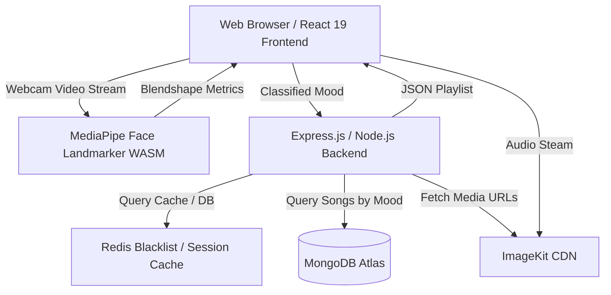

# Predicto 🎵🎭

Predicto is a state-of-the-art web application that harmonizes emotions through generative AI-driven soundscapes. By capturing the user's real-time facial expressions via a webcam, Predicto utilizes on-device machine learning (MediaPipe FaceLandmarker) to determine their current emotional state and serves a curated, mood-matching audio playlist.

---

## 🚀 Key Features

*   **Real-time On-Device Face Landmarking**: Captures and processes facial movements via webcam directly in the browser utilizing **Google MediaPipe** (float16 WebAssembly model).
*   **Aesthetic Expression Classification**: Translates 52 dynamic face blendshapes to classify emotional states in real time (e.g., *Very Happy*, *Happy*, *Sad*, *Surprise*, *Neutral*).
*   **Curated Mood Playlists**: Serves customized audio soundscapes matching the user's emotional state.
*   **Fully-Featured Custom Music Player**: Features a high-fidelity playback control panel with real-time seek, track navigation, auto-progression, volume settings, and mute functionality.
*   **Secure Authentication & Session Protection**:
    *   JWT-based session authentication inside secure, client-hidden `HttpOnly` cookies.
    *   **Redis Cache Integration**: State-of-the-art token blocklisting on logout to prevent replay attacks.
    *   Protected route guards (`<Protected>`) and Guest-only redirects (`<PublicOnly>`).
*   **ID3 Audio Metadata Ingest**: Automatically parses metadata (track title & cover artwork) from uploaded MP3 files during back-end ingestion, reducing manual input efforts.
*   **Cloud Media Hosting**: Stores and streams audio tracks and album art through **ImageKit.io** CDN.

---

## 🛠️ Architecture & Tech Stack

### System Flow Diagram


### Backend (Node.js & Express)
*   **Database**: MongoDB Atlas with Mongoose ORM.
*   **Caching & Blacklisting**: Redis database.
*   **Security & Encryption**: JSON Web Tokens (JWT), HTTPOnly cookies, and Bcrypt-hashed password security.
*   **Storage Provider**: `@imagekit/nodejs` SDK.
*   **File Parsing**: `multer` memory storage parser and `node-id3` metadata reader.

### Frontend (React 19 & Vite)
*   **Build System**: Vite.
*   **Routing**: React Router v7 (with nesting and route-based auth guards).
*   **Styling**: Vanilla Sass / SCSS style sheets.
*   **Machine Learning**: `@mediapipe/tasks-vision` SDK.
*   **API Client**: Axios.

---

## 📁 Workspace Directory Structure

```
Predicto/
├── Backend/                    # Express.js REST API
│   ├── src/
│   │   ├── config/             # DB & Caching clients (MongoDB, Redis)
│   │   ├── controllers/        # Route handlers (auth, song playlist)
│   │   ├── middlewares/        # JWT verification, upload validation
│   │   ├── models/             # Mongoose schemas (User, Song)
│   │   ├── routes/             # REST endpoints (/api/auth, /api/songs)
│   │   ├── services/           # ImageKit storage uploading
│   │   └── app.js              # Core middleware bindings
│   ├── server.js               # Backend service entrypoint
│   └── package.json
│
└── Frontend/                   # React 19 Client
    ├── src/
    │   ├── Features/           # Core Feature Bundles
    │   │   ├── Auth/           # Auth contexts, hooks, login & register pages
    │   │   ├── Expression/     # MediaPipe models, utils, face scanner page
    │   │   └── Song/           # Audio players, song hooks & playback logic
    │   ├── styles/             # Global Sass themes, configurations & components
    │   ├── app.routes.jsx      # Navigation route mapping & guards
    │   ├── main.jsx            # Entry point mount
    │   └── App.jsx             # Top-level context wrappers
    ├── vite.config.js          # Proxy and bundler configuration
    └── package.json
```

---

## 🔑 Environment Setup

### Backend Environment Configuration
Create a `.env` file inside the `Backend/` directory:
```env
PORT=5000
MONGO_URI=mongodb+srv://<username>:<password>@<cluster>.mongodb.net/predicto
JWT_SECRET=your_super_secure_jwt_secret
REDIS_URL=redis://localhost:6379
IMAGEKIT_PUBLIC_KEY=your_imagekit_public_key
IMAGEKIT_PRIVATE_KEY=your_imagekit_private_key
IMAGEKIT_URL_ENDPOINT=https://ik.imagekit.io/your_endpoint_id
NODE_ENV=development
```

---

## 🚀 Running the Project

### 1. Run the Backend Server
```bash
cd Backend
npm install
npm run dev
```
The server will start on port `5000` (or the configured `PORT`).

### 2. Run the Frontend Client
```bash
cd Frontend
npm install
npm run dev
```
The client will start on port `5173`. Make sure Redis and MongoDB are running to authenticate and retrieve playlists.

---

## 🌐 API Reference

### Authentication Endpoints (`/api/auth`)
| Method | Endpoint | Access | Description | Payload / Response |
| :--- | :--- | :--- | :--- | :--- |
| **POST** | `/register` | Public | Register a new user | `{ username, email, password }` |
| **POST** | `/login` | Public | Log in user, issue HTTPOnly cookie JWT | `{ usernameOrEmail, password }` |
| **GET** | `/profile` | Private | Retrieve active user details | Authenticated cookie session payload |
| **POST** | `/logout` | Private | Revokes JWT cookie & adds token to Redis blacklist | Invalidation notification |

### Song/Playlist Endpoints (`/api/songs`)
| Method | Endpoint | Access | Description | Payload / Response |
| :--- | :--- | :--- | :--- | :--- |
| **POST** | `/upload` | Private | Ingests new track; auto-parses ID3 tags and uploads metadata | Form-data: file input key `song`, text field `mood` |
| **GET** | `/` | Private | Query all tracks filtered by emotional mood | Query param: `?mood=<mood_string>` |

---

## 🛡️ Route Guards

The client routing is protected via route wrappers:
*   [Protected](file:///c:/Users/asus/Desktop/Predicto/Frontend/src/Features/Auth/components/Protected.jsx): Ensures users must be logged in. Authenticated profile loading prevents unauthorized pages from flickering.
*   [PublicOnly](file:///c:/Users/asus/Desktop/Predicto/Frontend/src/Features/Auth/components/PublicOnly.jsx): Restricts authenticated users from reaching guest-only registration, login, and landing screens, sending them straight to `/predict`.
